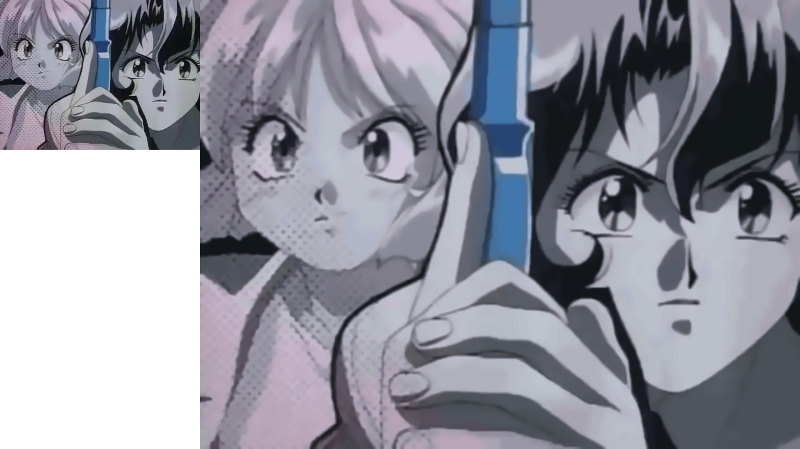
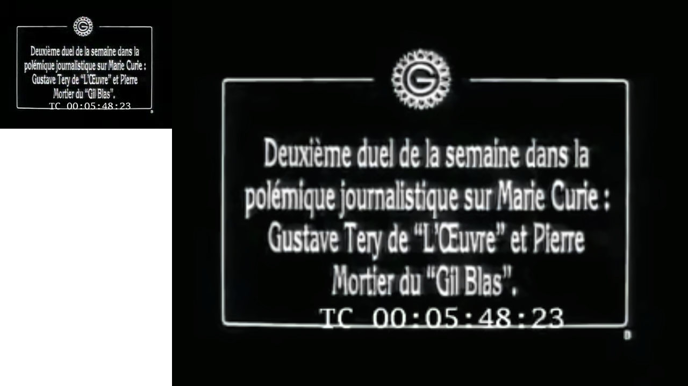
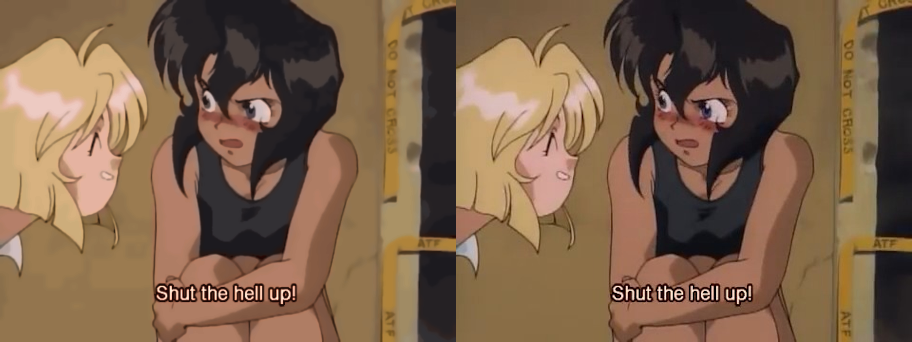
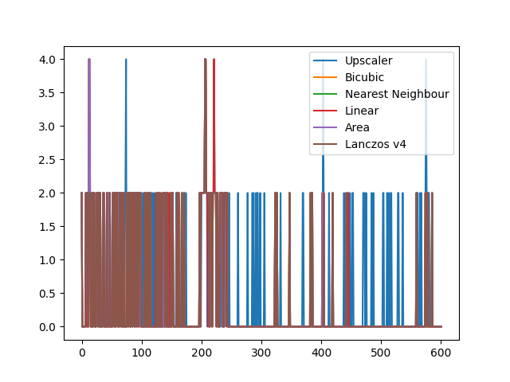
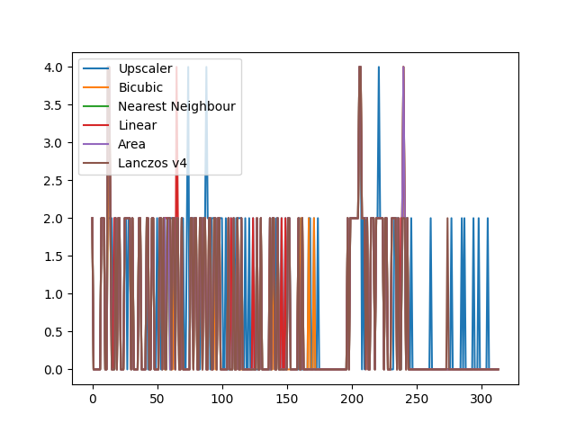
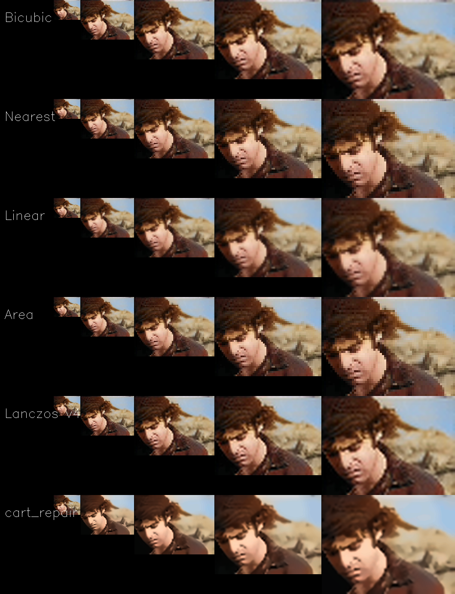

% A Basic Analysis of `cart_repair` Upscaling Algorithm

## Introduction

The `cart_repair` upscaling algorithm attempts to preserve the human perception of quality, whilst having some acceptable level of detail loss. As the algorithm is originally intended for video processing work, it was created with the idea that the human brain will fill in details that may come and go between individual frames so that the viewer is not particularly aware that the video they are watching is not a 1:1 preservation of the original.

In the subjective testing throughout development, it was found to work well on images up to 200% scaling, and depending on the subject media, have passable results at 300% scaling. It falls short above that scale.

However, the subjective analysis of an image doesn't supply us with a source of truth. This document reflects an attempt to create an objective measure to compare the algorithm against existing industry standard algorithms, and to provide a source of truth that could be used for further improvements to the algorithm.

Measuring the quality of an image is a difficult problem, and so we rely on a measure that may not be entirely appropriate all of the time, necessitating a larger dataset to draw any conclusions.

The industry-standard for measuring quality, Structural Similiarity (SSIM) indexing was examined as a possible measure early in the process, and discarded after it failed to tell the difference between several pairs of vastly different images.

## Technical Information

The dependencies for the test rig, are found in the file `requirements-test.txt`. (The usual dependencies must also be available).

Our upscaling algorithm does not intend to generate a 1:1 copy of an image, but rather an image that is perceptually similar to the original. A loss of detail for an increase in quality is acceptable, however the question is, how much loss of detail occurs? Measuring this objectively is extremely difficult. This paper approximates a way to measure the loss.

A copy of the generated JSON files for further analysis is hosted in git. [^githost]

---

## Overview of Testing

The supplied `test.py` script will attempt to extract the difference between the original and the upscaled version using an implementation [^imagehash] of Wavelet Hashing [^wavelethash].

[//]: # (Why choose wavelet hashing?)

The industry-standard for measuring quality, Structural Similiarity (SSIM) indexing was examined as a possible measure early in the process, and discarded after it failed to tell the difference between several pairs of vastly different images.

Wavelet Hashing, or hashing through the use of Discrete Wavelet Transformation (DWT), is an industry wide way of recording image differences and is used within the JPEG2000 standard [^jpeg2000] to help power the progressive features.

Our selected implementation of Wavelet Hashing is the Haar DWT, at a sample size of 4. It should be able to show us clear differences between the various upscaling algorithms.

    def process_frame(image, scale):
        pil_im = Image.fromarray(image)
        before_hash = imagehash.whash(pil_im)

        processed = cart_repair.process_frame(image, scale)
        pil_im = Image.fromarray(processed)
        after_hash = imagehash.whash(pil_im)

        diff = before_hash - after_hash
        return diff

The closer to 0 the value returned, the better our algorithm is preserving the original image. The return value is a Hamming distance value, where 5 and above is generally considered to be a significantly differing image in the industry.

The script also compares the result to the bicubic equivalent. It is expected that for bicubic upscaling the difference will usually be 0. It isn't altering the image significantly, despite the dramatic quality loss that often results. Pixelisation is ignored by most perceptual hashing algorithms.

Other comparisons also include: Nearest Neighbour, Bilinear, Area, and Lanczos v4.

Bicubic was chosen as the most important comparison as it is frequently the default interpolation method for many resizing algorithms utilised throughout the industry, despite its somewhat poor performance.

    def compare_frame(image, scale, interp = cv2.INTER_CUBIC):
        height, width, channels = image.shape
        pil_im = Image.fromarray(image)
        before_hash = imagehash.whash(pil_im)
        
        processed = cv2.resize(image,
            (math.floor(width * scale), math.floor(height * scale)),
            interpolation = interp)
        pil_im = Image.fromarray(processed)
        after_hash = imagehash.whash(pil_im)
        
        diff = before_hash - after_hash
        return diff

Our algorithm applies more extensive changes to the original image, and measuring that detail loss is possible through this process. When the upscaler receives a worse diff result than the bicubic equivalent, the dataset contains something that the upscaler fails to preserve accurately.

The upscaler does not preserve quality 1:1. This is known, and expected. This testing algorithm simply measures that.

---

## Generating Data

If you run the `test.py` script against a single image, it will return you just the difference between the original and final image.

To get the more extensive data, you need to run it against a video file. At completion (or interruption via the keyboard), the script will attempt to write the comparison plot to a file called `diffs.png`.

The raw data should also be written to a JSON (JavaScript Object Notation) file called `diffs.json`. The "upscaler" key contains the resulting diff using our algorithm, and the "bicubic" key contains the bicubic equivalent diff, and so on. The integers are Hamming distance values.

Example JSON:

    {"upscaler": [2, 0],
     "bicubic": [2, 0],
     "nearest": [2, 0],
     "linear": [2, 0],
     "area": [2, 0],
     "lanczos4": [2, 0]}

These outputs should be reproducible, if the same dataset (image or video file) is being tested.

The results of our own testing should be included in the following files:

* For 200% scaling: `diffs_x2.png` and `diffs_x2.json`

* For 300% scaling: `diffs_x3.png` and `diffs_x3.json`

---

## Results - 200% Scale

On our test dataset, a version of the 1911 Epee Dual [^epeedual] was processed, at a scale of 200%.

601 frames were examined.

The size of each frame was originally 320x240, and was upscaled to 640x480.

The exact command run was:

    python test.py -i demo.mp4 -s 2

[//]: # (Our generated plot of data:)

A simple plot shows that, for the most part, all the tested algorithms are relatively close to each other, which is what you would expect when scaling to 200%. However, you can already see that there are some differences that may become clearer when looking at the individual numbers.

---

### Hamming Distance Counts - 200% Scale

| Algorithm         | Distance: 0 | Distance: 2 | Distance: 4 |
| :---------------- | ----------: | ----------: | ----------: |
| Bicubic           | 114         | 485         | 2           |
| Nearest Neighbour | 111         | 486         | 4           |
| Bilinear          | 113         | 483         | 5           |
| Area              | 111         | 486         | 4           |
| Lanczos v4        | 116         | 483         | 2           |
| Ours              | 170         | 431         | 6           |

A Hamming distance of 0 means there is no difference found.

A Hamming distance of 2 means there is some difference found, but that the images are still likely the same. Usually there has been some quality loss between the images.

A Hamming distance of 4 means that there has been significant quality loss.

A Hamming distance of greater than 5 is a general rule for images that are not considered to be the same, used by the industry. Any upscale algorithm scoring a 5 can be considered to be a failure. Thankfully none of the tested algorithms failed at 200% scaling.

### Predictions of Quality Loss - 200% Scale

Translating this, we can make a few predictions.

These predictions are only true when looking at 200% scaling.

The table below shows the rough chance of experiencing quality loss when upscaling at 200%.

| Algorithm         | Expected Quality Loss | Expected Significant Quality Loss |
| :---------------- | --------------------: | --------------------------------: |
| Bicubic           | 81.03%                | 0.3%                              |
| Nearest Neighbour | 81.53%                | 0.6%                              |
| Bilinear          | 81.19%                | 0.8%                              |
| Area              | 81.53%                | 0.6%                              |
| Lanczos v4        | 80.69%                | 0.3%                              |
| Ours              | 72.71%                | 0.9%                              |

Our algorithm seems to suffer here somewhat. It has a higher chance of significant quality loss than any of the other algorithms. Worse even than bilinear upscaling.

However, the overall chance of quality loss is significantly less than any of the others.

---

## Results - 300% Scale

[//]: # (TODO: Framecount)

On our test dataset, a version of the 1911 Epee Dual [^epeedual] was processed, at a scale of 300%.

314 frames were examined.

The size of each frame was originally 320x240, and was upscaled to 960x720.

The exact command run was:

    python test.py -i demo.mp4 -s 3

[//]: # (Our generated plot of data:)

A simple plot shows that, for the most part, all the tested algorithms are relatively close to each other, which is what you would expect when scaling to 300%. However, you can already see that there are some differences that may become clearer when looking at the individual numbers.

---

### Hamming Distance Counts - 300% Scale

| Algorithm         | Distance: 0 | Distance: 2 | Distance: 4 |
| :---------------- | ----------: | ----------: | ----------: |
| Bicubic           | 91          | 219         | 4           |
| Nearest Neighbour | 95          | 214         | 5           |
| Bilinear          | 103         | 205         | 6           |
| Area              | 95          | 214         | 5           |
| Lanczos v4        | 96          | 214         | 4           |
| Ours              | 127         | 182         | 5           |

A Hamming distance of 0 means there is no difference found.

A Hamming distance of 2 means there is some difference found, but that the images are still likely the same. Usually there has been some quality loss between the images.

A Hamming distance of 4 means that there has been significant quality loss.

A Hamming distance of greater than 5 is a general rule for images that are not considered to be the same, used by the industry. Any upscale algorithm scoring a 5 can be considered to be a failure. Thankfully none of the tested algorithms failed at 300% scaling.

---

### Predictions of Quality Loss - 300% Scale

Translating this, we can make a few predictions.

These predictions are only true when looking at 300% scaling.

The table below shows the rough chance of experiencing quality loss when upscaling at 300%.

| Algorithm         | Expected Quality Loss | Expected Significant Quality Loss |
| :---------------- | --------------------: | --------------------------------: |
| Bicubic           | 71.01%                | 1.27%                             |
| Nearest Neighbour | 69.74%                | 1.59%                             |
| Bilinear          | 67.19%                | 1.91%                             |
| Area              | 69.74%                | 1.59%                             |
| Lanczos v4        | 69.42%                | 1.27%                             |
| Ours              | 59.55%                | 1.59%                             |

Once again, we see a marked difference between how well our algorithm performs, and how well the industry standards perform. However, the chance of significant data loss appears now to be no different than the other algorithms.

---

## An Overview of the Process

This is a high-level description of the process, which is slightly convoluted. You should not expect to be able to duplicate the results from this, however it may put you on the right track. The actual algorithm will be released to the public at some point, but for now it is only used in production by SIXTEENmm [^sixteenmm].

A copy of the original image is resized using a bilinear algorithm, and then denoised using a complicated algorithm. [^denoise]. This frame is blended at 50% with a black empty frame of the appropriate size.

Next, a X & Y Sobel gradient is generated from the smoothed but unblended layer, denoised using the same algorithm [^denoise], and then the colour inverted. This layer is blended onto the existing stack at 70%.

A K-means clustering algorithm is used to create a quantized layer. K-selection for the algorithm is slightly complicated, but is roughly:

    c10 = colour_count / 1000
    if c10 > 0:
        if c10 > 48:
            colour_count = c10
        else:
            colour_count = 48
    else:
        colour_count = 48

    if colour_count < 100:
        colour_count = colour_count * 2

This results in a minimum of 96 for K, without an upper bound but with a generally reasonable range of less than a thousand.

The quantized layer is then blended onto the stack at 70%.

The X & Y Sobel gradient layer from earlier is then re-blended onto the stack at 30%.

Finally we do some contrast correction, and then apply the denoising algorithm [^denoise] to the result.

---

# Extra Comparisons

As this is an image upscaling algorithm, it can be useful to do subjective analysis, despite the purpose of the above work to be to find some sort of objective source of truth.

So whilst the following image comparisons have little bearing on our analysis, they are nonetheless, interesting.

The process to create these images was as follows:

* Shrink the given image to 10% of the original scale (to make quality loss dramatic), using Lanczos v4.

    * Note that when upscaling from very small resolutions, you will find differing qualities amongst the algorithms than you find above. This is expected, and understood. However `cart_repair` should still be able to be visually compared.

* For integer scales in the range of 2 to 4, upscale the image using the given algorithm. (As above, the algorithms are Bicubic, Nearest Neighbour, Bilinear, Area, Lanczos v4 and `cart_repair`).

* Concatenate the images together.

The exact code can be found in `crush_compare.py`, and the exact command run was:

    python crush_compare.py -i input.jpg -o crush

Which resulted in:

---

[^imagehash]: Buchner, Johannes (2020). imagehash. https://github.com/JohannesBuchner/imagehash/

[^epeedual]: Pierre Mortier vs. Gustave Tery (1911). https://archive.org/details/1911pierremortiervsgustavetery

[^wavelethash]: Petrov, Dmitry (2016). Wavelet image hash in Python. https://fullstackml.com/wavelet-image-hash-in-python-3504fdd282b5

[^denoise]: Buades, Antoni. Coll, Bartomeu. Morel, Jean-Michel (2011).  Non-Local Means Denoising. https://www.ipol.im/pub/art/2011/bcm_nlm/

[^sixteenmm]: SIXTEENmm. https://sixteenmm.org

[^jpeg2000]: Pau, Gregoire (2006). Fast discrete biorthogonal CDF 9/7 wavelet forward and inverse transform (lifting implementation) https://web.archive.org/web/20120305164605/http://www.embl.de/~gpau/misc/dwt97.c

[^githost]: Milne, James (2020). A Basic Analysis of `cart_repair` Upscaling Algorithm. https://git.sr.ht/~shakna/upscaler_analysis
